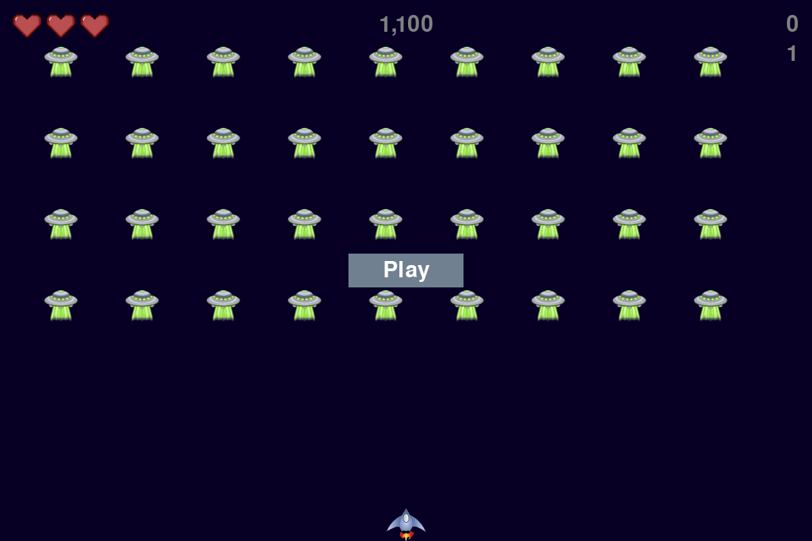
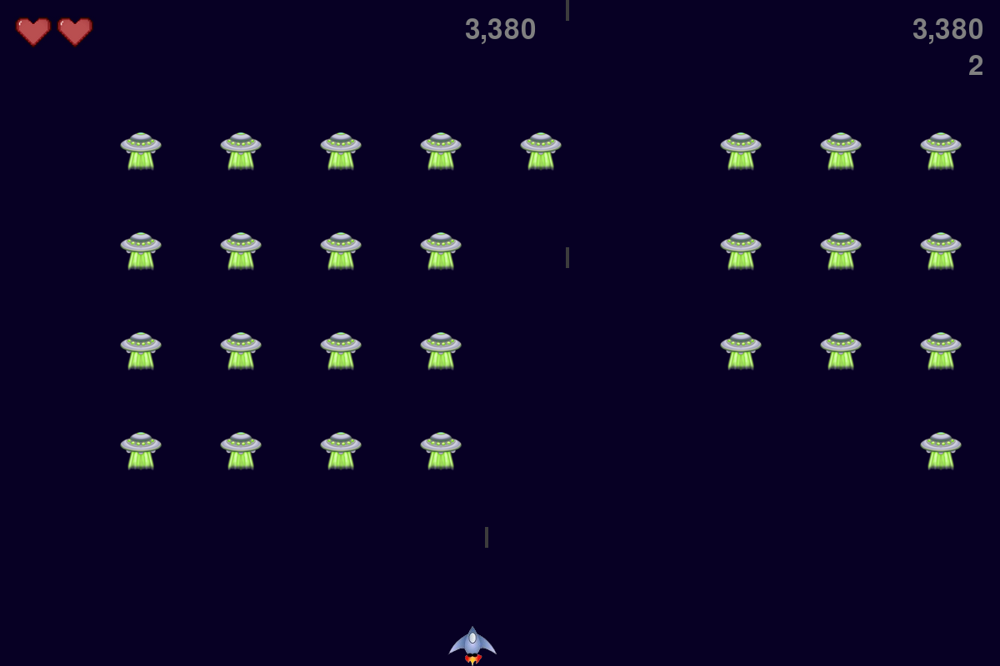
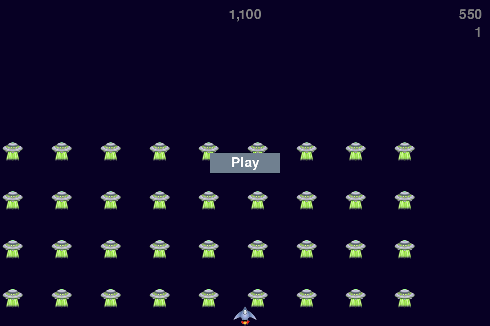

# Alien Invasion


## Overview
Alien Invasion is a 2D game developed using the Pygame module. Control a spaceship to shoot and destroy invading aliens, aiming to eliminate as many as possible.


## Features
- Start a game and close the game window with buttons (Play = "p", Quit = "q")
- Control a spaceship with keyboard inputs
- Shoot bullets to destroy aliens
- Aliens will move faster in new levels
- Scoring system based on the level and number of aliens destroyed, with higher-level aliens rewarding more points!


## Installation
Follow these steps to install the game and aim for a high score!
1. Clone the repository:
    ```bash
    git clone https://github.com/yourusername/alien-invasion.git
    ```
2. Navigate to the project directory:
    ```bash
    cd alien-invasion
    ```
3. Create and activate a virtual environment:
    ```bash
    python -m venv venv
    venv\Scripts\activate (on Windows)
    source venv/bin/activate (on macOS)
    ```
4. Install dependencies:
    ```bash
    pip install -r requirements.txt
    ```


## Usage
Your goal is to survive as long as possible while destroying waves of aliens.
1. Run the game:
    ```bash
    python alien_invasion.py
    ```
2. Use the arrow keys to move the spaceship.
3. Press the spacebar to shoot bullets.
4. Tap the "Q" key to quit the game.
5. You can also use the "P" key to start the game from the start screen.
6. Aim for a high score by destroying as many aliens as possible!


## Screenshots
### Start Screen


### Gameplay


### Defeat Screen


## Acknowledgments
- Special thanks to [Eric Matthes](https://ehmatthes.github.io/about/) for the amazing book **Python Crash Course**, which guided the development of this game.
- Special thanks to [Pygame](https://www.pygame.org) for the essential game development library.
